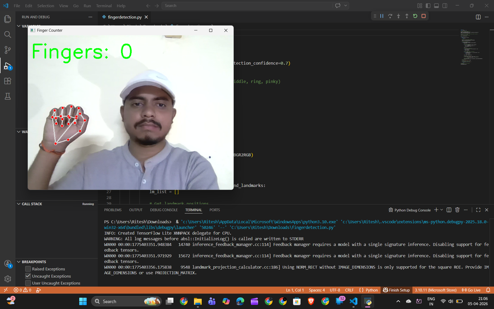
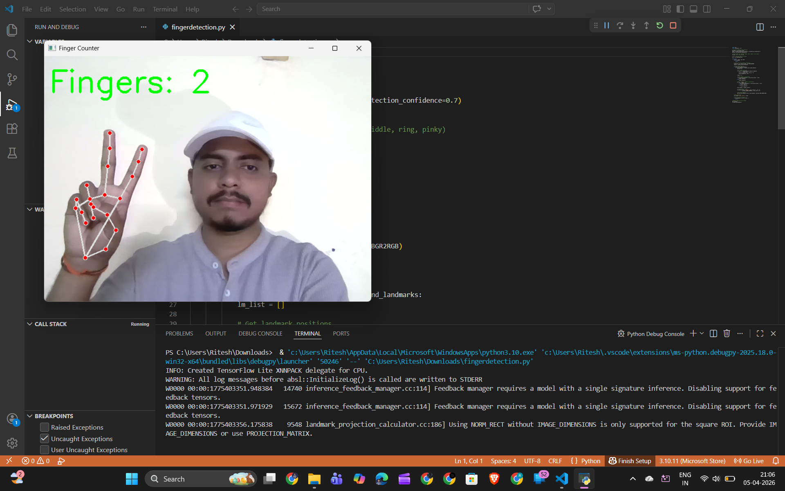
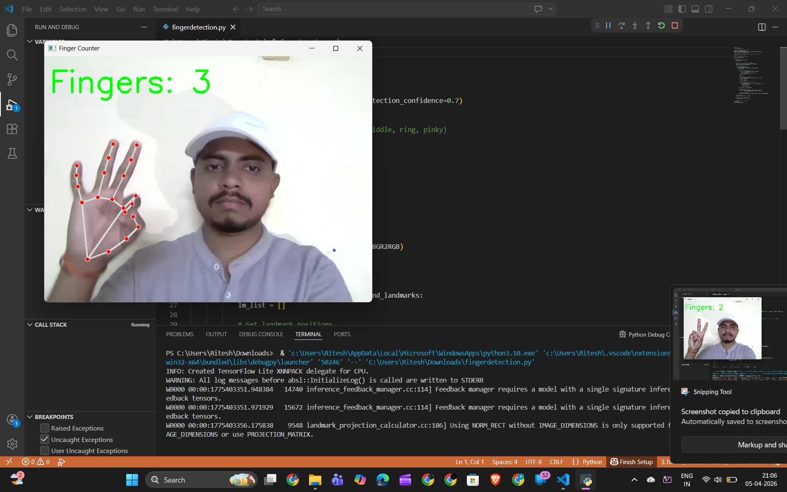
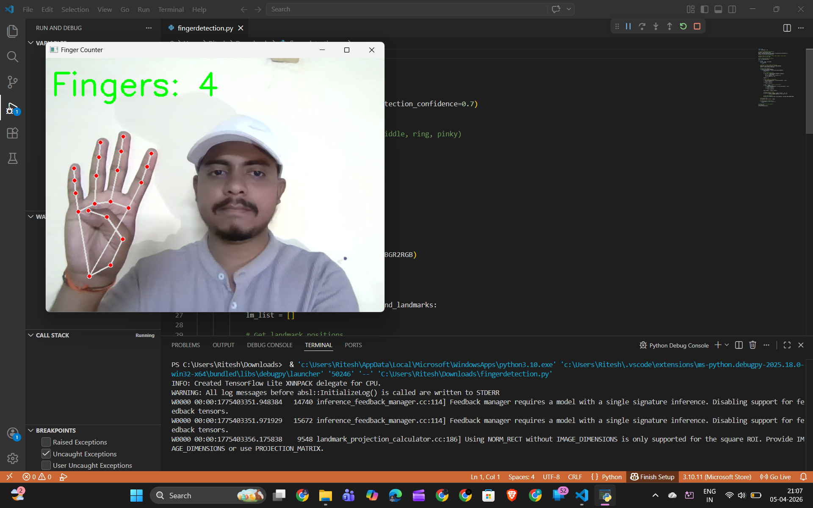
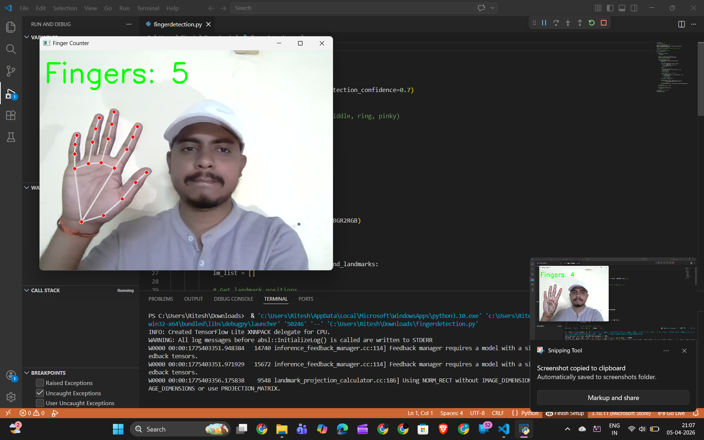

<!DOCTYPE html>
<html lang="en">
<head>
  <meta charset="UTF-8">

</head>
<body>
  <h1>Finger Counter Demo</h1>

  <!-- Image 1 -->
  <h2>Image 1: Fingers = 0</h2>
  

  <!-- Image 2 -->
  <h2>Image 2: Fingers = 1</h2>
  

  <!-- Image 3 -->
  <h2>Image 3: Fingers = 2</h2>
  

  <!-- Image 4 -->
  <h2>Image 4: Fingers = 3</h2>
  

  <!-- Image 5 -->
  <h2>Image 5: Fingers = 4</h2>
  

  <!-- Image 6 -->
  <h2>Image 6: Fingers = 5</h2>
  
  
 Author :- Ritesh Watane

</body>
</html>
